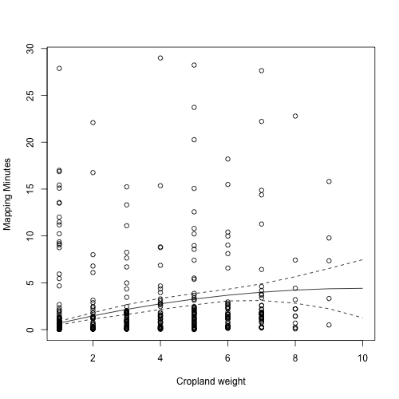

# Overview

This document provides the code used to analyze the trial data, to create the figures and statistics in the main text, and to report several supplementary results. 

# Libraries and data
```{r, message=FALSE, warning=FALSE}
library(raster)
library(lmisc)
library(rgeos)
library(dismo)
library(rgdal)
library(RColorBrewer)
library(data.table)
library(dtraster)
library(rmapaccuracy)
# library(devtools)
# install_github('wrswoR', 'krlmlr')
require(wrswoR)

proot <- "DIYlandcover-devel"
fpath <- full_path(proj_root(proot), proot)
setwd(fpath)
figpath <- full_path(fpath, "paper/figures")

# load data
for(i in dir("data/", pattern = "grids|safrica|geom|data|flds|prjstr")) {
  load(paste0("data/", i))
}
gcs <- "+proj=longlat +datum=WGS84 +no_defs +ellps=WGS84 +towgs84=0,0,0"
```

# Time span of data collection
```{r}
difftime(max(a_data$accept_time), min(a_data$accept_time), units = "hours")
```

Do some merging of different tables, and then number of unique fields mapped.
```{r}
ah_data <- merge(hit_data, a_data, by = "hit_id")
ah_data <- merge(ah_data, kml_data[, c("gid", "kml_type", "name")], 
                 by = "name")
status <- unique(a_data$status)  # assignment status
valid <- c("Approved", "Reversed", "Unsaved")
accepted <- c(valid, "Rejected")

qt <- ah_data$correct_name[ah_data$kml_type == "Q" & 
                             ah_data$status %in% accepted]
nt <- ah_data$correct_name[ah_data$kml_type == "N" & 
                             ah_data$status %in% accepted]

colnames(uflds@data)[2] <- "correct_ID"
ufldids <- unique(gsub("_.*", "", uflds$correct_ID))
uflds$correct_name <- gsub("_.*", "", uflds$correct_ID)

untf <- unique(ufldids[ufldids %in% nt])
uqtf <- unique(ufldids[!ufldids %in% nt])

print(paste(length(unique(qt)), "Q sites;", length(unique(nt)), "N sites;",
            length(uqtf), "Q sites w/ fields;", length(untf), 
            "N sites w/ fields"))
```

\hyperlink{toc}{Back to top}

# Number of assignments approved, rejected, returned
```{r}
sapply(status, function(x) nrow(a_data[a_data$status == x, ]))
```

# Plot mapped assignments
```{r, eval=FALSE, fig.align='center', fig.height=5, fig.width=5}
af <- readOGR("external/ext_data/africa_countries_alb.sqlite", 
              layer = "africa_countries_alb")
sa.sf <- raster("external/ext_data/sa.bound.grid.tif")  # sa grid
sa.sfsp <- as(sa.sf, "SpatialPixelsDataFrame")  # into spatialPixelsDataFrame
colnames(sa.sfsp@data) <- "ID"  # Rename column containing id value to ID
sa.sfsp@data$name <- paste("SA", sa.sfsp@data$ID, sep = "")  

fp <- raster("external/ext_data/ResampProbRast.tif")    # prob raster
fpvq <- round(quantile(fp, probs = seq(0, 1, 0.25)), 4)  # quantiles
reclmat <- cbind(fpvq[-length(fpvq)], fpvq[-1], 1:length(fpvq[-1]))
fp4 <- reclassify(fp, reclmat)  # sample weight raster

saex <- extent(sa.shp)
xyrat <- (saex@xmax - saex@xmin) / (saex@ymax - saex@ymin)
cx <- 0.7
cols <- brewer.pal(11, "RdBu")[c(10, 11, 3, 2)]
cols2 <- c("grey55", "grey50", "grey45", "grey40")
idlist <- list(nt, untf, qt, uqtf)

pdf(full_path(figpath, "fig5.pdf"), width = 7 * xyrat, height = 7, 
    bg = "transparent")
# png("paper/fig5.png", width = 7 * xyrat, height = 7, 
#     units = "in", res = 300, bg = "transparent")
par(mar = c(0, 0, 0, 0))
plot(sa.shp, xlim = c(saex@xmin, saex@xmax), ylim = c(saex@ymin, saex@ymax))
plot(spTransform(af, CRSobj = sa.shp@proj4string), add = TRUE, col = "grey80")
plot(fp4, col = cols2, legend = F, axes = F, add = TRUE)
plot(spTransform(af, CRSobj = sa.shp@proj4string), add = TRUE)
for(i in 1:4) {
  pts <- as(sa.sfsp[sa.sfsp$name %in% idlist[[i]], ], "SpatialPoints")
  points(pts, pch = 15, cex = cx, col = cols[i])
}
legend("bottomright", 
       legend = c("N no fields", "N with fields", "Q no fields", 
                  "Q with fields", paste("Prob", 1:4)),
       pch = 15, bty = "n", 
       col = c(cols, "grey70", "grey60", "grey50", "grey40"), 
       pt.cex = c(rep(1, 4), rep(2, 4))) 
dev.off()

```

\hyperlink{toc}{Back to top}

# Cropland weights and representativity

## Cropland weights for upscaling assessment

The GeoWiki cropland data layer provides the most accurate and comprehensive measure of cropland density currently available for Africa (Estes et al, in prep). The percentage values provide a measure of cropland occurrence probability that can be used to estimate likely worker effort, and to weight the random draws for site selection. We convert the percentages into 10 equal-interval weights catgerories.
```{r, eval = FALSE}
# Load in new master grid (from latest version Mapping Africa), built on GeoWiki
p_mast <- paste0("~/Dropbox/projects/mappingafrica/external/ext_data/", 
                 "africa_master_brick.tif")
mgrid <- brick(p_mast)

# Take all unique kmls sampled
all_kmls <- sa.sfsp[sa.sfsp$name %in% unique(unlist(idlist)), ]
all_kmls <- as(all_kmls, "SpatialPolygonsDataFrame")  # to spatial polygons

# Extract probabilities from new Africa master grid
gridp_af <- extract(mgrid[[2]], spTransform(all_kmls, mgrid@crs))
all_kmls$p_geow <- sapply(gridp_af, mean)  # geowiki cropland probs

# Extract from 4 class grid
gridp_za <- extract(fp4, all_kmls)
all_kmls$wgt_za <- sapply(gridp_za, mean)  # SA model weights

# Have to derive categorical weights from probabilities for SA, because original
# scheme was in slightly different projection, thus constructing average across
# cells
recl <- cbind(seq(0, 1, 0.1)[-11], seq(0, 1, 0.1)[-1], 1:10)
recl[10, 2] <- 1.01
all_kmls$wgt_geow <- sapply(all_kmls$p_geow, function(x) {
  for(y in 1:nrow(recl)) { 
    if((x >= recl[y, 1]) & (x < recl[y, 2])) o <- print(recl[y, 3])
  }
  o
})

save(all_kmls, file = "data/all_kmls.rda")

# Subset the master categorical grid for just South Africa, to provide a smaller starting example
# to do to get distribution of weights in South Africa
sagrid <- crop(mgrid[[3]], spTransform(sa.shp, mgrid@crs))
sagrid <- mask(sagrid, spTransform(sa.shp, mgrid@crs))

# convert to data.tables
# South Africa grid
sa_dt <- as.data.table(sagrid, progress = "text", xy = FALSE)
sa_dt <- na.omit(sa_dt)
setnames(sa_dt, old = colnames(sa_dt), new = c("wgts"))
sa_dt[, ID := 1:.N]  # add ID row
names_int <- c("ID", "wgts")
for(col in names_int) set(sa_dt, j = col, value = as.integer(sa_dt[[col]]))
sa_dt[, table(wgts)]

# Reorder SA for a test
# reorder with weighted random sampling scheme
# Set up row blocks per raster blockSize
b <- 20  # we want random draws of 5% of South Africa
size <- ceiling(nrow(sa_dt) / b)
row <- (0:(b - 1)) * size + 1
nrows <- rep(size, length(row))
dif <- b * size - nrow(sa_dt)
nrows[length(nrows)]  <-  nrows[length(nrows)] - dif
bs <- list(row = row, nrows = nrows, n = b)
samp_tab <- cbind.data.frame("block" = 1:bs$n, "nrows" = as.integer(bs$nrows),
                             "counter" = as.integer(rep(0, bs$n)))

# Create output list representing blocks of random draws
set.seed(234)
sa_dt_ss <- list()
for(i in samp_tab$block) {
  print(i)
  n <- nrow(sa_dt)
  og <- sa_dt[sample_int_rej(n, size = samp_tab$nrows[i], prob = wgts), ]
  sa_dt_ss[[i]] <- og
  sa_dt <- sa_dt[!ID %in% og[, ID]]
  print(paste("rows in sub-grid =", nrow(og), " - rows in master =", 
              nrow(sa_dt), "common rows in both is none:", 
              any(sa_dt[, ID] %in% og[, ID])))
}

sa_dt_reorder <- rbindlist(sa_dt_ss)  # reordered SA
sa_dt_reorder[, swgts := cumsum(wgts)]
# plot(1:nrow(sa_dt_reorder), sa_dt_reorder$swgts, type = "l")

# Do the same for all of Africa now
# Africa grid
af_dt <- as.data.table(mgrid[[c(1, 3)]], progress = "text", xy = FALSE)
af_dt <- na.omit(af_dt)
setnames(af_dt, old = colnames(af_dt), new = c("ID", "wgts"))
names_int <- c("ID", "wgts")
for(col in names_int) set(af_dt, j = col, value = as.integer(af_dt[[col]]))
# af_dt[, table(wgts)]

# Set up row blocks per raster blockSize
b <- 20  # we want random draws of 5% of Africa
size <- ceiling(nrow(af_dt) / b)
row <- (0:(b - 1)) * size + 1
nrows <- rep(size, length(row))
dif <- b * size - nrow(af_dt)
nrows[length(nrows)]  <-  nrows[length(nrows)] - dif
bs <- list(row = row, nrows = nrows, n = b)
samp_tab <- cbind.data.frame("block" = 1:bs$n, "nrows" = as.integer(bs$nrows),
                             "counter" = as.integer(rep(0, bs$n)))

# Create output list representing blocks of random draws
set.seed(234)
af_dt_ss <- list()
for(i in samp_tab$block) {
  print(i)
  n <- nrow(af_dt)
  og <- af_dt[sample_int_rej(n, size = samp_tab$nrows[i], prob = wgts), ]
  af_dt_ss[[i]] <- og
  af_dt <- af_dt[!ID %in% og[, ID]]
  print(paste("rows in sub-grid =", nrow(og), " - rows in master =", 
              nrow(af_dt), "common rows in both is none:", 
              any(af_dt[, ID] %in% og[, ID])))
}

af_dt_reorder <- rbindlist(af_dt_ss)  # reordered SA
af_dt_reorder[, swgts := cumsum(wgts)]
# plot(1:nrow(sa_dt_reorder), sa_dt_reorder$swgts, type = "l")
sids <- seq(1, nrow(af_dt_reorder), by = 10000)
af_dt_reorder[sids, plot(sids, swgts, type = "l")]

fnm <- "external/ext_data/africa_master_reorder.csv"
write.table(af_dt_reorder, file = fnm, sep = ",", col.names = TRUE, 
            row.names = FALSE)
```

## Representivity of smallholder fields

The GTI dataset classifies cropland types into several classes, one of which is communal and smallholder croplands. We intersected a gridded version of this dataset, created for a separate analysis (Estes et al, in prep), with the Q sites to see what proportion corresponded to these areas. 

```{r, eval=FALSE}
gtinm <- paste0("~/Dropbox/publications/SAcropland/external/ext_data/", 
                "cover2011.tif")
gtigrid <- brick(gtinm)

# Take all unique kmls sampled
q_kmls <- sa.sfsp[sa.sfsp$name %in% 
                    kml_data[kml_data$kml_type == "Q", "name"], ]
q_kmls <- as(q_kmls, "SpatialPolygonsDataFrame")  # to spatial polygons

qsmh <- extract(gtigrid[[2]], q_kmls)  # extract smallholder/communal sites 
gtifreq <- freq(gtigrid > 0)  # get frequencies of different cropland types
gtifreqs <- sapply(gtifreq, function(x) sum(x[1:2, "count"]))

qsmhmu <- sapply(qsmh, function(x) mean(x, na.rm = TRUE))
qsmhmu <- cbind.data.frame("name" = q_kmls$name, "area" = qsmhmu)

save(gtifreqs, qsmhmu, file = "external/ext_data/smallholder_areas.rda")
```

```{r, results='hold'}
setwd(fpath)
load("external/ext_data/smallholder_areas.rda")
print("Relative area of communal/smallholder farmlands")
unname(gtifreqs[2] / sum(gtifreqs))
print("Proportion of Q sites with fields in communal areas")
length(which(qsmhmu[!is.na(qsmhmu$area), "name"] %in% unique(qflds$ID))) / 
  length(unique(qflds$ID))
print("Proportion of Q sites intersecting communal fields mapped by GTI")
nrow(qsmhmu[!is.na(qsmhmu$area), ]) / 
  length(unique(qflds$ID))
```

# Worker data
```{r}
cut_time <- as.POSIXlt("2013-10-15", "%Y-%m-%d", tz = "EST")
tdat <- train_worker_data[train_worker_data$first_time < cut_time, ]
tdat <- tdat[order(tdat$first_time), ]
paste(length(unique(tdat$training_id)), "qualification seekers;",
      length(unique(tdat$worker_id)), "workers who qualified;", 
      length(unique(ah_data$worker_id)), "workers who mapped")
```

## Number of qualification seekers by time of day
```{r, eval=FALSE}
tdat$csum <- cumsum(rep(1, nrow(tdat)))
pdf(full_path(figpath, "figS1.pdf"), width = 5, height = 5, 
    bg = "transparent")
plot(tdat$first_time, tdat$csum, las = 2, xlab = "time", xaxt = "n", 
     ylab = "n qualification seekers", mgp = c(3, 0.75, 0))
points(tdat[!is.na(tdat$worker_id), "first_time"], 
       tdat[!is.na(tdat$worker_id), "csum"], pch = 20, col = "blue", cex = 1)
tseq <- seq(ISOdatetime("2013", "10", "02", "11", "00", "00"), 
            ISOdatetime("2013", "10", "03", "11", "00", "00"), by = 7200)
axis.POSIXct(1, at = tseq, las = 2, mgp = c(1, 0.6, 0))
legend(x = "bottomright", legend = c("qualified", "did not qualify"), 
       pch = c(16, 1), col = c("blue", "black"), bty = "n", pt.cex)
dev.off()
```

\hyperlink{toc}{Back to top}

## Calculate worker accuracy measures
```{r}
# N sites per worker, ratio of Q to N, percent of total work
worker <- unique(ah_data$worker_id)
worker_qn <- data.frame(t(sapply(worker, function(x) {
  dat <- ah_data[ah_data$worker_id == x, ]
  c("Q" = length(which(dat$kml_type == "Q")), 
    "N" = length(which(dat$kml_type == "N")))
})))
worker_qn <- worker_qn[order(rowSums(worker_qn)), ]
worker_qn$sum <- rowSums(worker_qn)
worker_qn$pct <- round(worker_qn$sum / sum(worker_qn$sum) * 100, 1)

# Accuracy 
qass <- ah_data[ah_data$kml_type == "Q" & !is.na(ah_data$score), ]
fids <- which(qass$correct_name %in% gsub("_.*", "", uflds$correct_name))
nfids <- which(!qass$correct_name %in% gsub("_.*", "", uflds$correct_name))

# Accuracy over time/number of HITs
wscores <- sapply(worker, function(x) qass[qass$worker_id == x, "score"])
wscores_sum <- data.frame(t(sapply(wscores, function(x) {
  c("mu" = mean(x), "n" = length(x))
})))

# N versus Q
scores <- cbind(do.call(cbind, 
                        hist(qass$score[fids], breaks = seq(0, 1, 0.1), 
                             plot = "F")[c("mids", "counts")]), 
                hist(qass$score[nfids], breaks = seq(0, 1, 0.1), 
                     plot = "F")$counts)

# Accuracy versus complexity
uqfnames <- qass[qass$correct_name %in% uflds$correct_name, "correct_name"]
qfnames <- qass$correct_name[which(qass$correct_name %in% qflds$ID)]
fnames <- unique(c(uqfnames, qfnames))
# Q field complexity
qverts <- sapply(fnames, function(x) {
  idin <- which(qflds$ID == x)
  if(length(idin) > 0) {
    qfld <- qflds[idin, ]
    verts <- sum(sapply(1:nrow(qfld), function(y) {
      nrow(slot(slot(slot(qfld[y, ], "polygons")[[1]], "Polygons")[[1]],
                "coords"))  # count number of vertices in polygons  
    }))  
  } else {
    verts <- 0
  }
  return(verts)
})

# Worker Q field complexity 
uqverts <- sapply(fnames, function(x) {
  idin <- which(uflds$correct_name == x)
  if(length(idin) > 0) {
     qfld <- uflds[idin, ]
     verts <- sum(sapply(1:nrow(qfld), function(y) {
       nrow(slot(slot(slot(qfld[y, ], "polygons")[[1]], "Polygons")[[1]],
                 "coords"))  # count number of vertices in polygons  
     }))
  } else {
    verts <- 0
  }
  return(verts)
})

# merge vertex count datasets with Q assignment data
uqverts <- cbind.data.frame("nms" = names(uqverts), uqverts)
qverts <- cbind.data.frame("nms" = names(qverts), qverts)
verts <- merge(qverts, uqverts, "nms")
keep <- c("correct_name", "kml_type", "assignment_id", "score")
verts <- merge(qass[, keep], verts, by.x = "correct_name", by.y = "nms", 
               sort = FALSE)

# Calculate score based on TSS
error_data$tssc <- (error_data$tss + 1) / 2
error_data$score_tss <- error_data$error1 * 0.1 + error_data$error2 * 0.2 + 
  error_data$tssc * 0.7   # bug here, used count_error where needed out_error

# Merge with vertex and Q assignment data
verts2 <- merge(verts, error_data, by = "assignment_id")
verts2$scdiff <- verts2$score.x - verts2$score_tss  # difference between scores


# Fits
acc_lm <- lm(verts2$score.x ~ verts2$qverts)  # score vs Q vertices
acc_lmtss <- lm(verts2$score_tss ~ verts2$qverts)  # tss score vs Q verts
acc_scdiff <- lm(scdiff ~ qverts, data = verts2)  # score-tss score vs Q verts
acc_lm2 <- lm((verts2$uqverts - verts2$qverts) ~ verts2$qverts)  # U vs Q verts
wscores_sum <- wscores_sum[order(wscores_sum$n), ]
wscores_sum <- wscores_sum[!is.na(wscores_sum$mu), ]
acc_nls <- nls(mu ~ cbind(1, exp(-n / b)), start = list(b = 45), 
               alg = "plinear", data = wscores_sum)  # score versus experience

pfunc <- function(p) {
  pv <- c(1, 0.1, 0.05, 0.01, 0.001, 0.000000000000000000000000000000000000001)
  pvm <- cbind.data.frame(pv[-1], pv[-6], "s" = c("NS", "+", "*", "**", "***"), 
                          stringsAsFactors = FALSE)
  pvm[sapply(1:nrow(pvm), function(x) (p < pvm[x, 2]) & p > pvm[x, 1]), 3]
}
```

\hyperlink{toc}{Back to top}

## Accuracy statistics
```{r, echo = FALSE, results='hold'}
print("TSS in relation to number of Q vertices")
summary(lm(verts2$score_tss ~ verts2$qverts))  # F = 0.98, p < 0.32
print("Normal accuracy measure minus TSS variant, all sites: mean")
mean(error_data$score - error_data$score_tss)
print("mean accuracy score")
mean(error_data$score)
print("mean accuracy score, TSS variant")
mean(error_data$score_tss)
print("Normal accuracy measure minus TSS variant, field sites: mean")
mean(verts2$scdiff)
print("Normal accuracy measure minus TSS variant for Q vertices < 25 and 50")
mean(verts2$scdiff[verts2$qverts < 25])  ## paper stat
mean(verts2$scdiff[verts2$qverts < 50])  # paper stat
print("Inside the box error (type 3) for sites with fields")
mean(verts2[verts2$qverts > 0, "error3"])
print("Inside the box error (type 3) for sites without fields")
mean(error_data[!error_data$assignment_id %in% 
             verts2[verts2$qverts > 0, "assignment_id"], "error3"])
```

\hyperlink{toc}{Back to top}

## Accuracy plots
```{r, eval = FALSE}
# Sites per worker, Q:N ratios
adj <- -0.17
L <- 0.5; L2 <- -0.8; L3 <- -1.65
cx <- 1.3; cxm <- 1.5
pdf(full_path(figpath, "fig6.pdf"), width = 7, height = 8, bg = "transparent")
par(mfrow = c(3, 2), mar = c(3, 3, 1, 1), mgp = c(1.6, 0.25, 0),  tcl = -0.2, 
    cex.axis = 0.85, cex = 0.9, las = 2, oma = c(0, 0, 1.25, 0))
plot(worker_qn$sum, worker_qn$Q / worker_qn$sum * 100, yaxt = "n", xaxt = "n",
     col = "grey45", pch = 16, xlab = "N assignments", ylab = "Q:N ratio (%)",
     xlim = c(0, 300))
for(i in 1:2) axis(i, las = 2)
mu_qrat <- mean(worker_qn$Q / worker_qn$sum * 100) 
expr <- substitute(paste(mu, "=", s), list(s = round(mu_qrat)))
lines(c(-50, 350), rep(mu_qrat, 2), lwd = 2, lty = 2)
text(x = 300, y = mu_qrat, labels = expr, cex = 0.8, adj = c(0.7, -0.3))
text(x = worker_qn$sum[-c(1:2, 4)], 
     y = (worker_qn$Q / worker_qn$sum)[-c(1:2, 4)] * 100, col = "grey45",
     labels = round(worker_qn$pct[-c(1:2, 4)]), adj = c(-0.5, 0.5), cex = 0.8)
mtext(text = "A", side = 3, adj = adj, las = 1, cex = cx, line = L)

# accuracy barplots
bp <- barplot(height = t(scores[, 2:3]), ylim = c(0, 120), yaxt = "n", 
              col = c("black", "grey60"), beside = TRUE, xlab = "Score", 
              space = rep(0, nrow(scores) * 2), ylab = "# of assignments")
axis(1, at = bp[2, ] + 0.5, seq(0.1, 1, 0.1), las = 2)
axis(2, las = 2)
s <- round(mean(qass$score[fids]), 2)
leg <- c(substitute(paste("fields; ", mu, "=", s), 
                    list(s = round(mean(qass$score[fids]), 2))), 
         substitute(paste("no fields; ", mu, "=", s), 
                    list(s = round(mean(qass$score[nfids]), 2))))
l <- legend("topleft", legend = c("", ""), pch = 15, col = c("black", "grey60"), 
            bty = "n", pt.cex = 2)
for(i in 1:2) text(l$text$x[i], l$text$y[i], labels = leg[[i]], adj = c(0, 0.5))
mtext(text = "B", side = 3, adj = adj, las = 1, cex = cx, line = L)

# score versus complexity
plot(verts2$qverts, verts2$score.x, pch = 16, col = "grey45", 
     xlab = "Q vertices", ylab = "Score")
abline(acc_lm)
mtext(text = "C", side = 3, adj = adj, las = 1, cex = cx, line = L)
mtext(pfunc(summary(acc_lm)$coefficients[2, 4]),  cex = cx * cxm, 
      at = max(verts2$qverts), side = 3, line = L2)

# Q complexity versus worker map complexity
plot(qverts$qverts, uqverts$uqverts - qverts$qverts, pch = 16, col = "grey45", 
     xlab = "Q vertices", ylab = "Worker - Q vertices")#, axes = FALSE)
abline(acc_lm2)
mtext(text = "D", side = 3, adj = adj, las = 1, cex = cx, line = L)
mtext(pfunc(summary(acc_lm2)$coefficients[2, 4]), cex = cx * cxm, las = 1, 
      at = max(verts2$qverts), side = 3, line = L3, adj = 1)

# complexity versus difference in score algorithm 
plot(verts2$qverts, verts2$scdiff, pch = 16, col = "grey45", #axes = FALSE,
     xlab = "Q vertices", ylab = "Score: Normal - TSS")
lo_acc <- lowess(x = verts2$qverts, y = verts2$score.x - verts2$score_tss)
lines(lo_acc$x, lo_acc$y)
mtext(text = "E", side = 3, adj = adj, las = 1, cex = cx, line = L)

# worker experience versus accuracy
plot(wscores_sum$n, wscores_sum$mu, pch = 16, col = "grey45", #axes = FALSE,
     xlab = "Q assignments", ylab = expression(paste(mu, " score")))
lines(1:60, predict(acc_nls, data.frame(n = 1:60)))
mtext(text = "F", side = 3, adj = adj, las = 1, cex = cx, line = L)
mtext(pfunc(summary(acc_nls)$coefficients[2, 4]), cex = cx * cxm, las = 1, 
      at = max(wscores_sum$n), side = 3, line = L3, adj = 1)
dev.off()
```

\hyperlink{toc}{Back to top}

# Calculate costs
```{r, echo = FALSE, eval = FALSE}
# This in an initial check, compared to further down
costs <- ah_data[ah_data$status %in% valid, ]

rbind("QN" = c("total" = nrow(costs) * 0.15, 
               "w/AWS" = nrow(costs) * 0.15 * 1.1), 
      "Q" = c(length(which(costs$kml_type == "Q")) * 0.15, 
              length(which(costs$kml_type == "Q")) * 0.15 * 1.1), 
      "N" = c(length(which(costs$kml_type == "N")) * 0.15, 
              length(which(costs$kml_type == "N")) * 0.15 * 1.1))
```

```{r}
# Bonus rates and supporting function
bonus <- cbind(c(0, 0.6, 0.85, 0.975, 0.99), c(0.6, 0.85, 0.975, 0.99, 1.001))
brate <- c(0, 0.01, 0.02, 0.03, 0.05)
inrange <- function(x, mat) {
  v <- ifelse(is.na(x), 0, x)
  o <- sapply(1:nrow(mat), function(j) {
    ifelse((v >= mat[j, 1]) & (v < mat[j, 2]), j, 0) 
  })
  return(sum(o))
}

# Calculate moving average accuracy scores
ma <- function(x, n = 5) slot(filter(x, rep(1 / n, n), sides = 1), ".Data")
wscores2 <- lapply(worker, function(x) {
  df <- qass[qass$worker_id == x, 
             c("worker_id", "assignment_id", "accept_time", "completion_time", 
               "score")]
  df[order(df$accept_time), ]
})
score_avg <- do.call(rbind, lapply(wscores2, function(x) {
  df <- x[, c(1:2, 5)]
  a <- df$score
  if(length(a) >= 5) {  # calculate moving average if > 5 scores
    o <- ma(a)
    o[is.na(o)] <- 0  # set NA values to 0
  } else {
    o <- 0  # no long-term average if < 5 scores
  }
  if(nrow(df) > 0) {
    df$smu <- o
  } else {
    df <- 0   
  }
  df
}))

load(full_path(fpath, "data/all_kmls.rda"))

# overall costs
bcosts <- ah_data[, c("correct_name", "assignment_id", "worker_id", "kml_type",
                      "status", "accept_time", "completion_time", "score")]
bcosts <- merge(bcosts, score_avg, by = c("worker_id", "assignment_id"), 
                all.x = TRUE)  # merge with average score
bcosts <- merge(bcosts, all_kmls@data[, c("name", "wgt_za", "wgt_geow")], 
                by.x = "correct_name", by.y = "name")
bcosts <- bcosts[, c(2:3, 1, 4:ncol(bcosts))]

# calculate cost relative to time
moneytime <- do.call(rbind, lapply(worker, function(x) {
  df <- bcosts[bcosts$worker_id == x, ]
  df <- df[order(df$accept_time), ]
  nnas <- which(!is.na(df$smu))  # count number of assignments bonus eligible
  if(length(nnas) == 0) {  # if 0, set bonus rate to 0
    df$smu2 <- 0
    df$bonus <- 1
    df$brate <- 0
  } else {  # if > 0
    ind <- c(which(!is.na(df$smu)), nrow(df))  # extract bonus eligible sites
    if(ind[1] > 1) ind <- c(1, ind)  
    smu <- cbind(ind, df$smu[ind])
    smu[which(is.na(smu[, 2])), 2] <- 0
    indmat <- cbind(ind[-length(ind)], ind[-1])
    smumat <- cbind(indmat, smu[-nrow(smu), 2])
    df$smu2 <- rep(0, nrow(df))
    for(i in 1:nrow(indmat)) {
      ivec <- smumat[i, 1]:smumat[i, 2]
      df$smu2[ivec] <- smumat[i, 3]  #df$smu[indmat[i, 1]]
    }
    df$bonus <- sapply(1:nrow(df), function(k) inrange(df$smu2[k], bonus))
    df$brate <- brate[df$bonus]
  }
  atime <- round(as.numeric(difftime(df$completion_time, df$accept_time, 
                                     units = "mins")), 2)  # mapping time
  atime2 <- atime
  atime2[atime2 > 30] <- NA  # set to NA if greater than 30
  cbind(df, atime, atime2)
}))

# merge with vertex information
mtdat <- merge(moneytime, verts2[, c("assignment_id", "qverts", "uqverts")], 
               by.x = "assignment_id", by.y = "assignment_id", sort = FALSE, 
               all.x = TRUE, all.y = TRUE)
mtdat <- mtdat[order(mtdat$worker_id, mtdat$accept_time), ]
mtdat$uqverts[is.na(mtdat$uqverts)] <- 0  # set NA q vertices to 0

# convert it to a data.table, for easier ordering in later time calcs
mtdat_dt <- data.table(mtdat, key = "wgt_geow")  # convert

# Pay functions
# calculate pay based on weighting and fixed rate
payfunc <- function(wgt, ratemat) {
  ratemat[ratemat$wgt == wgt, "rate"]
}

# calculate pay metrics
# updated function allows different rates based on weighting schemes to be 
# tested
paytime_calcs <- function(mtdat, worker, ratemat, wgt) {
  wpay <- data.frame(t(sapply(worker, function(x) {
    df <- mtdat[mtdat$worker_id == x, ]
    # df$frate <- rep(0.15, nrow(df))
    df$frate <- sapply(1:nrow(df), function(y) payfunc(df[y, wgt], ratemat))
    df[!df$status %in% valid, c("frate", "brate")] <- 0  # reject set to zero
    df$valid <- rep(NA, nrow(df))
    df$valid[df$status %in% valid] <- 1
    df$valid[!df$status %in% valid] <- 0
    # df <- df[df$status %in% valid, ]
    o <- c("n" = nrow(df[df$valid == 1, ]), "fix" = sum(df$frate), 
           #"fix" = nrow(df) * 0.15, 
           "bonus" = sum(df$brate),  # total bonus
           "f_fix" = sum(df[df$uqverts > 0, "frate"]), # pay for fields
           "nf_fix" = sum(df[df$uqverts == 0, "frate"]),  # pay w/out fields
           # "f_fix" = nrow(df[df$uqverts > 0, ]) * 0.15,  # pay for fields
           # "nf_fix" = nrow(df[df$uqverts == 0, ]) * 0.15,  # pay w/out fields
           "nQ" = nrow(df[df$kml_type == "Q" & df$valid == 1, ]),  # N Q sites
           "nN" = nrow(df[df$kml_type == "N" & df$valid == 1, ]),  # N N sites
           "Q_fix" = sum(df$frate[df$kml_type == "Q"], na.rm = TRUE),
           "Q_bonus" = sum(df$brate[df$kml_type == "Q"], na.rm = TRUE),
           "N_fix" = sum(df$frate[df$kml_type == "N"], na.rm = TRUE),
           "N_bonus" = sum(df$brate[df$kml_type == "N"], na.rm = TRUE),
           "f_bonus" = sum(df$brate[df$uqverts > 0]),  # bonus rate with flds
           "nf_bonus" = sum(df$brate[df$uqverts == 0]),  # without fields
           "nverts" = sum(df$uqverts[df$uqverts > 0]),  # nvertices (total)
           "score" = mean(df$score.y, na.rm = TRUE)) # mean score
    o2 <- c("mutime" = mean(df$atime, na.rm = TRUE),  # mean mapping time
            "ttime" = sum(df$atime, na.rm = TRUE),  # total time
            "mutime_a" = mean(df$atime2, na.rm = TRUE), # mean time adj
            "ttime_a" = sum(df$atime2, na.rm = TRUE),  # total time adj
            "fttime_a" = sum(df$atime2[df$uqverts > 0], na.rm = TRUE), 
            "nfttime_a" = sum(df$atime2[df$uqverts == 0], na.rm = TRUE)) / 60
    c(o, round(o2, 2))
  })))
  return(wpay)
}

# Test different rates
# trial rate
# vinc <- 0.1  # incremental rate
# mtexp <- 0.01 * (1 + 0.7)^(1:10 - 1)
# plot(mtexp)

# plot((1:10)^3 / 100 * (vinc * 0.25))
# plot(0.01 + 1.7 * ((1:10 - 1) * vinc) - 1.5 * ((1:10 - 1) * vinc)^2 )
# plot(1:10 + ((1:10)^3 / 100 * (vinc * 0.25)))
# plot(0.01 + 3 * ((1:10 - 1) * vinc2) - 9 * ((1:10 - 1) * vinc2)^2)

fnm <- full_path(fpath, "external/ext_data/africa_master_reorder.csv")
af_dt_reorder <- fread(fnm)

# Find variable rates that are closest to flat rates, based on the frequency of # the different weight categories
frate1 <- 0.15
frate2 <- 0.15 / 3
wfreq <- af_dt_reorder[, table(wgts)]  # wgt table
wfreqf <- wfreq / sum(wfreq)  # frequency of different categories
vincs <- seq(0.005, 0.5, 0.01)  
b1 <- 0.01
trates1 <- sapply(vincs, function(x) {
  sum(b1 + ((1:10 - 1) * x) * wfreqf)
})  # 
b2 <- 0.01
trates2 <- sapply(vincs, function(x) {
  sum(b2 + ((1:10 - 1) * x) * wfreqf)
})  # 
vinc <- vincs[which.min(abs(trates1 - frate1))]  # higher pay variable rate
# lower pay variable rate = set to 1/3 of higher because increment is tiny
vinc2 <- vincs[which.min(abs(trates2 - frate2))]  # higher pay variable rate
vinc2 <- vinc / 3

paywgts <- list("mtf1" = rep(frate1, 10), 
                "mtv1" = b1 + ((1:10 - 1) * vinc), 
                #"mtexp" = b1 + ((1:10)^3 / 100 * vinc),
                #"mtpoly" = b1 + 2 * ((1:10 - 1) * vinc) - 1.5 * 
                #  ((1:10 - 1) * vinc)^2, 
                "aff1" = rep(frate2, 10), 
                "afv1" = b2 + ((1:10 - 1) * vinc2)) #, 
                #"afexp" = b2 + ((1:10)^3 / 100 * vinc2),
                #"afpoly" = b2 + 3 * ((1:10 - 1) * vinc2) - 9 * 
                #  ((1:10 - 1) * vinc2)^2)

rates <- lapply(paywgts, function(x) cbind.data.frame(wgt = 1:10, rate = x))

# calculate costs in list
vs <- c("ttime_a", "fttime_a", "nfttime_a")
# cost_list <- lapply(list(mtratef, mtratev, afratef, afratev), function(x) {
cost_list <- lapply(rates, function(x) {
  pay <- paytime_calcs(mtdat, worker, x, "wgt_geow")
  for(i in vs) pay[pay[, i] == 0, i] <- NA  # remove zeros from times
  pay
})
names(cost_list) <- names(paywgts)#c("mtfix", "mtvar", "affix", "afvar")

# total costs
totcosts <- lapply(cost_list, function(x) {
  # x <- cost_list$mtfix
  tcosts <- rbind(colSums(x[, c("nQ", "Q_fix", "Q_bonus")], na.rm = TRUE),
                  colSums(x[, c("nN", "N_fix", "N_bonus")], na.rm = TRUE))
  colnames(tcosts) <- c("N", "Fixed", "Bonus")
  rownames(tcosts) <- c("Q", "N")
  odf <- rbind.data.frame(tcosts, "QN" = colSums(tcosts))
  cbind(odf, "Total" = round(rowSums(odf[, 2:3]), 2))
})

# # checking relationship between time since start and accuracy score. Too noisy
# score_verts <- lapply(worker, function(x) {
#   df <- mtdat[mtdat$worker_id == x, ]
#   df <- df[df$kml_type == "Q" & df$status %in% valid, ]
#   df$qverts[is.na(df$qverts)] <- 0
#   if(nrow(df) > 4) {
#     dflm <- lm(score.x ~ qverts, data = df)
#     cbind(df, "resid" = residuals(dflm))
#   } else {
#     cbind(df, "resid" = rep(NA, nrow(df)))
#   }
# })

```

\hyperlink{toc}{Back to top}

Supplementary plot of time versus n assignments 
```{r, eval=FALSE}
mtdats <- mtdat[order(mtdat$accept_time), ]
mtdats$n <- cumsum(rep(1, nrow(mtdats)))
pdf(full_path(figpath, "figS2.pdf"), width = 5, height = 5, 
    bg = "transparent")
plot(mtdats$accept_time, mtdats$n, las = 2, xlab = "time", xaxt = "n",  
     ylab = "n assignments", mgp = c(3, 0.75, 0), pch = 16, cex = 0.5)
points(mtdats[mtdats$kml_type == "Q", "accept_time"], pch =  ".",
       mtdats[mtdats$kml_type == "Q", "n"], col = "red", cex = 1)
n_lm <- lm(n ~ accept_time, data = mtdats)
abline(n_lm)
tseq <- seq(ISOdatetime("2013", "10", "02", "11", "00", "00"), 
            ISOdatetime("2013", "10", "03", "17", "00", "00"), by = 7200)
axis(1, at = tseq, labels = as.character(strftime(tseq, format = "%H:%M")), 
     las = 2, mgp = c(1, 0.6, 0))
legend(x = "bottomright", legend = c("N", "Q"), pch = 16, 
       pt.cex = c(1, 0.5), col = c("black", "red"), bty = "n")
dev.off()
```

## Cost estimates
Total costs, with and without bonus
```{r, results='hold'}
totcosts
```

The same, with 10% Amazon mark-up
```{r}
aws_sum_tot <- lapply(totcosts, function(x) {
  round(cbind(x[, 2:3], "Total" = rowSums(x[, 2:3])) * 1.1, 2)
})
aws_sum_tot
```
\hyperlink{toc}{Back to top}

Mean hourly rates, without bonus
```{r}
avg_wages <- t(sapply(cost_list, function(x) {
  c("avgwage" = mean(x$fix / x$ttime_a, na.rm = TRUE),
    "avgwage_flds" = mean(x$f_fix / x$fttime_a, na.rm = TRUE),
    "avgwage_noflds" = mean(x$nf_fix / x$nfttime_a, na.rm = TRUE))  
}))
round(avg_wages, 2)
```

\hyperlink{toc}{Back to top}

And with bonus
```{r}
avg_wagesbonus <- t(sapply(cost_list, function(x) {
  c("avgwage" = mean((x$fix + x$bonus) / x$ttime_a, na.rm = TRUE),
    "avgwage_flds" = mean((x$f_fix + x$f_bonus) / x$fttime_a, na.rm = TRUE),
    "avgwage_noflds" = mean((x$nf_fix + x$nf_bonus) / x$nfttime_a, 
                            na.rm = TRUE))  
}))
wage_xtab <- xtable::xtable(avg_wagesbonus)
round(avg_wagesbonus, 2)
```

\hyperlink{toc}{Back to top}

Note that the sum of pay from `wpay` is slightly larger than with `totcosts`, because we are calculating worker time versus pay with the former, rather than the latter, which looks at costs to us (we don't pay for unaccepted assignments).
```{r}
unlist(lapply(cost_list, function(x) sum(x$bonus, x$fix)))
```

\hyperlink{toc}{Back to top}

## Mapping time and cost figures

Using the weights from the master grid of Africa as a measure of mapping effort, and as a basis for weighted random sampling of assignments to workers, model the time needed to map an assignment as a function of the weights. 

```{r, eval = FALSE}
# First, estimate the time per density category
# A second order polynomial seems like a good model
setnames(mtdat_dt, "wgt_geow", "wgts")
lm_poly <- lm(atime2 ~ poly(wgts, 2), data = mtdat_dt)  # fit poly
summary(lm_poly)

# Let's do a bootstrap to get the confidence interval
set.seed(234)
lm_list <- lapply(1:1000, function(x) {
  lm_poly <- lm(atime2 ~ poly(wgts, 2), 
                data = mtdat_dt[sample(1:.N, size = 0.5 * .N), ])  # fit poly
  pred_poly <- predict(lm_poly, newdata = data.frame("wgts" = 1:10))  # predictions with confint
})
pred_dist <- do.call(rbind, lm_list)
fit <- colMeans(pred_dist)
conf <- apply(pred_dist, 2, function(x) quantile(x, probs = c(0.05, 0.95)))

png("paper/figures/figS3.png", height = 500, width = 500)
mtdat_dt[, plot(wgts, atime2, xlab = "Cropland weight", 
                ylab = "Mapping Minutes")]
lines(1:10, fit)  # fit
lines(1:10, conf[2, ], lty = 2)  # upper
lines(1:10, conf[1, ], lty = 2)  # lower
dev.off()

```



\hyperlink{toc}{Back to top}

Now with predicted mapping time per weight, we can estimate cumulative mapping time as a function of the order in which the weights would be sampled. 

```{r, eval = FALSE}
# af_dt_reorder <- fread("external/ext_data/africa_master_reorder.csv")

# First assign the predicted values for each level 
for(i in 1:10) af_dt_reorder[wgts == i, tmu := fit[i]]
for(i in 1:10) af_dt_reorder[wgts == i, tup := conf[2, i]]
for(i in 1:10) af_dt_reorder[wgts == i, tdn := conf[1, i]]

# Create cumulative sum and map
af_dt_reorder[, tcum_mu := round(cumsum(tmu) / 60, 2)]
af_dt_reorder[, tcum_up := round(cumsum(tup) / 60, 2)]
af_dt_reorder[, tcum_dn := round(cumsum(tdn) / 60, 2)]

# function to convert hours to years, as a function of N workers
tmod <- function(tcum, n, tdy) (tcum / (24 * 365)) * 1 / ((n * tdy) / 24)

```

And cumulative mapping costs, as a function of different pay models. We'll use a fixed and variable cost model. 

```{r, eval = FALSE}
# Different cost models
mubonus <- totcosts$mtf1$Bonus[3] / totcosts$mtf1$N[3]  # mean bonus

# MT payment models 
af_dt_reorder[, fcost1 := 0.15 + mubonus]  # fixed  
for(i in 1:10) {  # variable cost model
  af_dt_reorder[wgts == i, vcost1 := rates$mtv1[i, "rate"] + mubonus]  
}

# Africa cost models 
af_dt_reorder[, afcost1 := rates$aff1[1, 2] + mubonus]  # fixed
for(i in 1:10) { # variable
  af_dt_reorder[wgts == i, afvcost1 := rates$afv1[i, "rate"] + mubonus]
} 

# make cumulative costs, increasing by 40% for estimated costs of QC (1:10), 
# administrative, and crowdsource hosting
af_dt_reorder[, f1cost_cum := round(cumsum(fcost1) * 1.4, 2)]
af_dt_reorder[, v1cost_cum := round(cumsum(vcost1) * 1.4, 2)]
af_dt_reorder[, af1cost_cum := round(cumsum(afcost1) * 1.4, 2)]
af_dt_reorder[, afvcost_cum := round(cumsum(afvcost1) * 1.4, 2)]

af_dt_reorder[, 14:17, with = FALSE]

```

## Scaled-up time and cost plots
```{r, eval=FALSE}
# Start with cost
cxl <- 0.7
pdf("paper/figures/fig7.pdf", height = 3, width = 7)
par(bg = "transparent")
kmsq <- c(seq(1, nrow(af_dt_reorder), by = 10000), nrow(af_dt_reorder))
kmax <- seq(0, 30000000, 2000000)  # axis positions
nms <- c("f1cost_cum", "v1cost_cum", "af1cost_cum", "afvcost_cum")
cols <- c(rep("blue", 2), rep("green3", 2))
ltp <- c(1, 2, 1, 2)
par(mfrow = c(1, 2), mgp = c(1, 0.25, 0), tcl = -0.15, mar = c(3, 3, 1, 2))
plot(c(1, 30000000), c(0, 7), axes = FALSE, pch = "", 
     xlab = "", ylab = "", xaxs  = "i", yaxs  = "i")
axis(1, at = kmax, labels = kmax / 1000000, las = 2, cex.axis = cxl)
axis(2, at = seq(0, 10, 1), las = 2, cex.axis = cxl)
mtext("$ (millions)", side = 2, line = 1)
mtext(expression(km^2), side = 1, line = 1)
for(i in 1:4) {
  lines(kmsq, af_dt_reorder[kmsq, get(nms[i]) / 1000000], col = cols[i], 
        lty = ltp[i])  
}
legend("topleft", cex = cxl, x.intersp = 0.75, title = "Pay rate", 
       y.intersp = 0.75, 
       legend = c("High fixed", "High variable", "Low fixed", "Low variable"), 
       col = cols, lty = ltp, bty = "n")

# Now time
nms <- c("tcum_up", "tcum_mu", "tcum_dn")
ltp <- c(2, 1, 2)
lw = c(1, 2, 1)
plot(c(1, 30000000), c(0, 15), axes = FALSE, pch = "", 
     xlab = "", ylab = "", xaxs  = "i", yaxs  = "i")
axis(1, at = kmax, labels = kmax / 1000000, las = 2, cex.axis = cxl)
axis(2, at = seq(0, 15, 1), las = 2, cex.axis = cxl)
mtext("Years", side = 2, line = 1)
mtext(expression(km^2), side = 1, line = 1)
for(i in 1:3) {
  lines(kmsq, af_dt_reorder[kmsq, tmod(get(nms[i]), 100, 1)], col = "red", 
        lty = ltp[i], lwd = lw[i])  
  lines(kmsq, af_dt_reorder[kmsq, tmod(get(nms[i]), 250, 1)], col = "blue", 
        lty = ltp[i], lwd = lw[i])  
  lines(kmsq, af_dt_reorder[kmsq, tmod(get(nms[i]), 500, 1)], col = "green4", 
        lty = ltp[i], lwd = lw[i])  
}
legend("topleft", title = "N workers", x.intersp = 0.75, y.intersp = 0.75,
       legend = c("500", "250", "100"), lwd = 2, cex = cxl, 
       col = c("green3", "blue", "red"), lty = 1, bty = "n")
dev.off()
```


\hyperlink{toc}{Back to top}

## Figure of workers' combined training maps
```{r, eval=FALSE}
# training geometries
train_geom_trial <- train_geom[train_geom$completion_time < cut_time, ]
train_geom_trial[, 2] <- gsub("^SRID=*.*;", "", train_geom_trial[, 2])

# trainees
trainees <- unique(train_worker_data[train_worker_data$first_time < 
                                       cut_time, "training_id"])
trainees <- trainees[trainees %in% unique(train_error_data$training_id)]

# Some gymnastics to get the data training ids retained for each set of training
# maps, which entails having to construct unique IDs for each polygon
# convert training polygons from wkt to SPDF, merge back training data
keep <- c("name", "completion_time", "training_id", "try")
tflds <- lapply(trainees, function(x) {
  tgeoms <- train_geom_trial[train_geom_trial$training_id == x, ]
  tflds <- polyFromWkt(geom.tab = tgeoms, crs = gcs)
  tflds@data <- sp::merge(tflds@data, tgeoms[, keep], by.x = "ID", 
                          sort = FALSE, by.y = "name")
  tflds$grname <- gsub("_.*", "", tflds$ID)
  tflds
})
# construct polygons indices
tlens <- sapply(tflds, function(x) length(x))
tflens <- unlist(lapply(1:length(tlens), function(x) {
  rep(x, tlens[x])
}))
inds <- lapply(unique(tflens), function(x) {
  inds <- which(tflens == x)
  inds[1]:inds[length(inds)]
})
# apply unique labels and rowbind polygons
tflds <- do.call(rbind, lapply(1:length(tflds), function(x) {
  print(unique(tflds[[x]]$training_id))
  polys <- lapply(1:length(tflds[[x]]), function(y) {
    poly <- spChFIDs(tflds[[x]][y, ], as.character(inds[[x]][y]))
  })
  newpolys <- do.call(rbind, polys)
}))

# now to unique training sites
tids <- c("SA188774", "SA90531", "SA3470", "SA88962", "SA91222", "SA226678", 
          "SA200999", "SA355992")
tflds <- spTransform(tflds, CRS(prjstr))

# pull out the relevant sample grids
grid_polys <- lapply(tids, function(x) {
  grids[which(grids$ID == x), ]
})
names(grid_polys) <- tids

# extract sample grids and the background polygons for each
bmaps <- lapply(1:length(grid_polys), function(x) {
  print(names(grid_polys)[x])
  gpoly <- spTransform(grid_polys[[x]], CRS(gcs))
  e <- extent(gpoly) + c(-0.002, 0.002, -0.002, 0.002)
  bmap <- dismo::gmap(e, type = "satellite")
  ind <- which(tflds$grname == names(grid_polys)[x])
  if(length(ind) > 0) {
    tpoly <- spTransform(tflds[ind, ], CRSobj = bmap@crs)
  } else {
    tpoly <- 0
  }
  gpoly <- spTransform(gpoly, CRSobj = bmap@crs)
  list("base" = bmap, "grid" = gpoly, "tmaps" = tpoly)
})

# x <- bmaps$SA88962
tfldsr <- lapply(bmaps, function(x) {
  print(x$grid$ID)
  if(class(x$tmaps) == "SpatialPolygonsDataFrame") {
    maps <- x$tmaps
    intrainees <- trainees[which(trainees %in% unique(maps$training_id))]
    fldr <- sapply(intrainees, function(y) {
      polys <- maps[maps$training_id == y, ]
      r <- rasterize(polys, x$base)
      r[r >= 1] <- 1
      r[is.na(r)] <- 0
      return(r)
    })
    names(fldr) <- intrainees
  } else {
    fldr <- 0
  }
  return(fldr)
})

# sum and standardize rasterized field boundaries
ind <- which(sapply(tfldsr, function(x) ifelse(is.numeric(x), 0, 1)) == 1)
tfldsr_sum <- lapply(ind, function(x) {
  s <- stack(tfldsr[[x]])
  ss <- calc(s, sum)
  ssf <- calc(stack(tfldsr[[x]]), sum) / length(trainees)
})

labs <- 1:8
col_inc <- seq(0, 1, 0.1)
cols <- brewer.pal(n = 11, name = "RdYlBu")
cx <- 1.5
cvec <- c("transparent", rev(cols[-(length(col_inc) - 1)]))
pdf("paper/figures/fig8.pdf", height = 8, width = 7)
par(bg = "transparent", mar = c(0, 0, 0, 0), mfrow = c(4, 4), 
    oma = c(5, 0, 0, 0))
for(i in 1:8) {
  e <- extent(bmaps[[i]]$base)
  plot(bmaps[[i]]$grid, border = "black", lwd = 2, xlim = c(e@xmin, e@xmax), 
       ylim = c(e@ymin, e@ymax))
  plot(bmaps[[i]]$base, add = TRUE)
  plot(bmaps[[i]]$grid, border = "black", lwd = 2, add = TRUE)
  mtext(side = 3, text = labs[i], adj = 0.1, line = -2.5, cex = cx, 
        col = "white")
  plot(bmaps[[i]]$grid, border = "black", lwd = 2, xlim = c(e@xmin, e@xmax), 
       ylim = c(e@ymin, e@ymax))
  plot(bmaps[[i]]$base, add = TRUE)
  plot(bmaps[[i]]$grid, border = "black", lwd = 2, add = TRUE)
  if(i %in% ind) {
    plot(tfldsr_sum[[which(ind == i)]], add = TRUE, legend = FALSE, col = cvec, 
         breaks = col_inc)
  }
  mtext(side = 3, text = labs[i], adj = 0.1, line = -2.5, cex = cx, 
        col = "white")
}
ldim <- c(0.2, 0.8)
lpos <- c(0.05, 0.02)
ncuts <- length(col_inc) - 1
flex_legend(ncuts = ncuts, legend.text = "Fraction of trainees' polygons", 
            legend.vals = round(col_inc, 2), cex.val = cx, 
            leg.adj = c(-0.1, -0.25),  textside = "bottom", 
            colvec = cvec, longdims = ldim, legend.pos = c(4, 2), 
            shortdims = c(lpos[1], lpos[2]))
tcrds <- rect_coords(minWorS = ldim[1], maxEorN = ldim[2], ncuts = ncuts, 
                     "EW", lpos[1], lpos[2])
tcrds <- rbind(tcrds[[1]][1, ], 
               do.call(rbind, lapply(1:ncuts, function(x) tcrds[[x]][2, ])))
text(x = tcrds[, 1], y = tcrds[, 2], labels = sprintf("%0.2f", col_inc), 
     adj = c(1.1, 0.5), srt = 90, cex = cx)
dev.off()
```

\hyperlink{toc}{Back to top}


