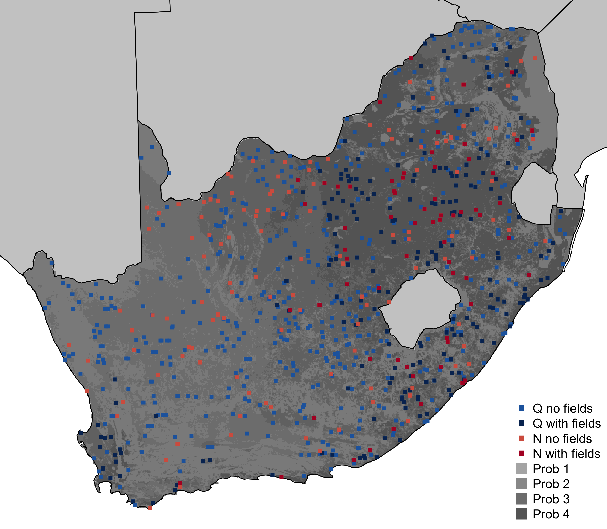

# ___DIYlandcover___ trial analyses and plots
Lyndon Estes  

## Libraries and data

```r
library(raster)
library(lmisc)
library(rgeos)
library(dismo)
library(rgdal)
library(RColorBrewer)
fpath <- full_path(proj_root("DIYlandcover"), "DIYlandcover")
setwd(fpath)
figpath <- full_path(fpath, "paper/figures")

# load data
for(i in dir("data/", pattern = "grids|safrica|geom|data|flds|prjstr")) {
  load(paste0("data/", i))
}
gcs <- "+proj=longlat +datum=WGS84 +no_defs +ellps=WGS84 +towgs84=0,0,0"
```
[[back to top]][Libraries and data]

## Time span of data collection

```r
difftime(max(a_data$accept_time), min(a_data$accept_time), units = "hours")
```

```
## Time difference of 26.37515 hours
```

Do some merging of different tables, and then number of unique fields mapped.

```r
ah_data <- merge(hit_data, a_data, by = "hit_id")
ah_data <- merge(ah_data, kml_data[, c("gid", "kml_type", "name")], 
                 by = "name")
status <- unique(a_data$status)  # assignment status
valid <- c("Approved", "Reversed", "Unsaved")
accepted <- c(valid, "Rejected")

qt <- ah_data$correct_name[ah_data$kml_type == "Q" & 
                             ah_data$status %in% accepted]
nt <- ah_data$correct_name[ah_data$kml_type == "N" & 
                             ah_data$status %in% accepted]

colnames(uflds@data)[2] <- "correct_ID"
ufldids <- unique(gsub("_.*", "", uflds$correct_ID))
uflds$correct_name <- gsub("_.*", "", uflds$correct_ID)

untf <- unique(ufldids[ufldids %in% nt])
uqtf <- unique(ufldids[!ufldids %in% nt])

print(paste(length(unique(qt)), "Q sites;", length(unique(nt)), "N sites;",
            length(uqtf), "Q sites w/ fields;", length(untf), 
            "N sites w/ fields"))
```

```
## [1] "185 Q sites; 707 N sites; 65 Q sites w/ fields; 216 N sites w/ fields"
```

## Number of assignments approved, rejected, returned

```r
sapply(status, function(x) nrow(a_data[a_data$status == x, ]))
```

```
##  Approved  Rejected Abandoned  Returned  Reversed   Unsaved 
##       880        10         2        51         1         1
```
[[back to top]][Libraries and data]

## Plot mapped assignments

```r
af <- readOGR("external/ext_data/africa_countries_alb.sqlite", 
              layer = "africa_countries_alb")
sa.sf <- raster("external/ext_data/sa.bound.grid.tif")  # sa grid
sa.sfsp <- as(sa.sf, "SpatialPixelsDataFrame")  # into spatialPixelsDataFrame
colnames(sa.sfsp@data) <- "ID"  # Rename column containing id value to ID
sa.sfsp@data$name <- paste("SA", sa.sfsp@data$ID, sep = "")  

fp <- raster("external/ext_data/ResampProbRast.tif")    # prob raster
fpvq <- round(quantile(fp, probs = seq(0, 1, 0.25)), 4)  # quantiles
reclmat <- cbind(fpvq[-length(fpvq)], fpvq[-1], 1:length(fpvq[-1]))
fp4 <- reclassify(fp, reclmat)  # sample weight raster

saex <- extent(sa.shp)
xyrat <- (saex@xmax - saex@xmin) / (saex@ymax - saex@ymin)
cx <- 0.7
cols <- brewer.pal(11, "RdBu")[c(10, 11, 3, 2)]
cols2 <- c("grey55", "grey50", "grey45", "grey40")

pdf(full_path(figpath, "fig5.pdf"), width = 7 * xyrat, height = 7, 
    bg = "transparent")
# png("Rmd/fig5.png", width = 7 * xyrat, height = 7, 
#     units = "in", res = 300, bg = "transparent")
par(mar = c(0, 0, 0, 0))
plot(sa.shp, xlim = c(saex@xmin, saex@xmax), ylim = c(saex@ymin, saex@ymax))
plot(spTransform(af, CRSobj = sa.shp@proj4string), add = TRUE, col = "grey80")
plot(fp4, col = cols2, legend = F, axes = F, add = TRUE)
plot(spTransform(af, CRSobj = sa.shp@proj4string), add = TRUE)
plot(sa.sfsp[sa.sfsp$name %in% nt, ], pch = 15, cex = cx, add = TRUE, 
     col = cols[1])
plot(sa.sfsp[sa.sfsp$name %in% untf, ], pch = 15, cex = cx, add = TRUE, 
     col = cols[2])
plot(sa.sfsp[sa.sfsp$name %in% qt, ], pch = 15, cex = cx, add = TRUE, 
     col = cols[3])
plot(sa.sfsp[sa.sfsp$name %in% uqtf, ], pch = 15, cex = cx, add = TRUE, 
     col = cols[4])
legend("bottomright",
       legend = c("Q no fields", "Q with fields", "N no fields", 
                  "N with fields", paste("Prob", 1:4)),
       pch = 15, bty = "n", 
       col = c(cols, "grey70", "grey60", "grey50", "grey40"), 
       pt.cex = c(rep(1, 4), rep(2, 4))) 
dev.off()
```
[[back to top]][Libraries and data]


Locations of assignments mapped.


## Worker data

```r
cut_time <- as.POSIXlt("2013-10-15", "%Y-%m-%d", tz = "EST")
tdat <- train_worker_data[train_worker_data$first_time < cut_time, ]
tdat <- tdat[order(tdat$first_time), ]
paste(length(unique(tdat$training_id)), "qualification seekers;",
      length(unique(tdat$worker_id)), "workers who qualified;", 
      length(unique(ah_data$worker_id)), "workers who mapped")
```

```
## [1] "36 qualification seekers; 18 workers who qualified; 15 workers who mapped"
```

### Number of qualification seekers by time of day

```r
tdat$csum <- cumsum(rep(1, nrow(tdat)))
pdf(full_path(figpath, "figS1.pdf"), width = 5, height = 5, 
    bg = "transparent")
plot(tdat$first_time, tdat$csum, las = 2, xlab = "time", xaxt = "n", 
     ylab = "n qualification seekers", mgp = c(3, 0.75, 0))
points(tdat[!is.na(tdat$worker_id), "first_time"], 
       tdat[!is.na(tdat$worker_id), "csum"], pch = 20, col = "blue", cex = 1)
tseq <- seq(ISOdatetime("2013", "10", "02", "11", "00", "00"), 
            ISOdatetime("2013", "10", "03", "11", "00", "00"), by = 7200)
axis.POSIXct(1, at = tseq, las = 2, mgp = c(1, 0.6, 0))
legend(x = "bottomright", legend = c("qualified", "did not qualify"), 
       pch = c(16, 1), col = c("blue", "black"), bty = "n", pt.cex)
dev.off()
```
[[back to top]][Libraries and data]

### Calculate worker accuracy measures

```r
# N sites per worker, ratio of Q to N, percent of total work
worker <- unique(ah_data$worker_id)
worker_qn <- data.frame(t(sapply(worker, function(x) {
  dat <- ah_data[ah_data$worker_id == x, ]
  c("Q" = length(which(dat$kml_type == "Q")), 
    "N" = length(which(dat$kml_type == "N")))
})))
worker_qn <- worker_qn[order(rowSums(worker_qn)), ]
worker_qn$sum <- rowSums(worker_qn)
worker_qn$pct <- round(worker_qn$sum / sum(worker_qn$sum) * 100, 1)

# Accuracy 
qass <- ah_data[ah_data$kml_type == "Q" & !is.na(ah_data$score), ]
fids <- which(qass$correct_name %in% gsub("_.*", "", uflds$correct_name))
nfids <- which(!qass$correct_name %in% gsub("_.*", "", uflds$correct_name))

# Accuracy over time/number of HITs
wscores <- sapply(worker, function(x) qass[qass$worker_id == x, "score"])
wscores_sum <- data.frame(t(sapply(wscores, function(x) {
  c("mu" = mean(x), "n" = length(x))
})))

# N versus Q
scores <- cbind(do.call(cbind, 
                        hist(qass$score[fids], breaks = seq(0, 1, 0.1), 
                             plot = "F")[c("mids", "counts")]), 
                hist(qass$score[nfids], breaks = seq(0, 1, 0.1), 
                     plot = "F")$counts)

# Accuracy versus complexity
uqfnames <- qass[qass$correct_name %in% uflds$correct_name, "correct_name"]
qfnames <- qass$correct_name[which(qass$correct_name %in% qflds$ID)]
fnames <- unique(c(uqfnames, qfnames))
# Q field complexity
qverts <- sapply(fnames, function(x) {
  idin <- which(qflds$ID == x)
  if(length(idin) > 0) {
    qfld <- qflds[idin, ]
    verts <- sum(sapply(1:nrow(qfld), function(y) {
      nrow(slot(slot(slot(qfld[y, ], "polygons")[[1]], "Polygons")[[1]],
                "coords"))  
    }))
  } else {
    verts <- 0
  }
  return(verts)
})

# Worker Q field complexity 
uqverts <- sapply(fnames, function(x) {
  idin <- which(uflds$correct_name == x)
  if(length(idin) > 0) {
     qfld <- uflds[idin, ]
     verts <- sum(sapply(1:nrow(qfld), function(y) {
       nrow(slot(slot(slot(qfld[y, ], "polygons")[[1]], "Polygons")[[1]],
                 "coords"))  
     }))
  } else {
    verts <- 0
  }
  return(verts)
})

# merge vertex count datasets with Q assignment data
uqverts <- cbind.data.frame("nms" = names(uqverts), uqverts)
qverts <- cbind.data.frame("nms" = names(qverts), qverts)
verts <- merge(qverts, uqverts, "nms")
keep <- c("correct_name", "kml_type", "assignment_id", "score")
verts <- merge(qass[, keep], verts, by.x = "correct_name", by.y = "nms", 
               sort = FALSE)

# Calculate score based on TSS
error_data$tssc <- (error_data$tss + 1) / 2
error_data$score_tss <- error_data$error1 * 0.1 + error_data$error1 * 0.2 + 
  error_data$tssc * 0.7

# Merge with vertex and Q assignment data
verts2 <- merge(verts, error_data, by = "assignment_id")
verts2$scdiff <- verts2$score.x - verts2$score_tss  # difference between scores

# Fits
acc_lm <- lm(verts2$score.x ~ verts2$qverts)  # score vs Q vertices
acc_lmtss <- lm(verts2$score_tss ~ verts2$qverts)  # tss score vs Q verts
acc_scdiff <- lm(scdiff ~ qverts, data = verts2)  # score-tss score vs Q verts
acc_lm2 <- lm((verts2$uqverts - verts2$qverts) ~ verts2$qverts)  # U vs Q verts
wscores_sum <- wscores_sum[order(wscores_sum$n), ]
wscores_sum <- wscores_sum[!is.na(wscores_sum$mu), ]
acc_nls <- nls(mu ~ cbind(1, exp(-n / b)), start = list(b = 45), 
               alg = "plinear", data = wscores_sum)  # score versus experience

pfunc <- function(p) {
  pv <- c(1, 0.1, 0.05, 0.01, 0.001, 0.000000000000000000000000000000000000001)
  pvm <- cbind.data.frame(pv[-1], pv[-6], "s" = c("NS", "+", "*", "**", "***"), 
                          stringsAsFactors = FALSE)
  pvm[sapply(1:nrow(pvm), function(x) (p < pvm[x, 2]) & p > pvm[x, 1]), 3]
}
```
[[back to top]][Libraries and data]

### Accuracy statistics

```
## [1] "TSS in relation to number of Q vertices"
## 
## Call:
## lm(formula = verts2$score_tss ~ verts2$qverts)
## 
## Residuals:
##      Min       1Q   Median       3Q      Max 
## -0.46214 -0.22598  0.02245  0.22384  0.33990 
## 
## Coefficients:
##                 Estimate Std. Error t value Pr(>|t|)    
## (Intercept)    0.7071366  0.0385264  18.355   <2e-16 ***
## verts2$qverts -0.0003658  0.0002947  -1.241    0.219    
## ---
## Signif. codes:  0 '***' 0.001 '**' 0.01 '*' 0.05 '.' 0.1 ' ' 1
## 
## Residual standard error: 0.2428 on 70 degrees of freedom
## Multiple R-squared:  0.02154,	Adjusted R-squared:  0.00756 
## F-statistic: 1.541 on 1 and 70 DF,  p-value: 0.2186
## 
## [1] "Normal accuracy measure minus TSS variant, all sites: mean"
## [1] 0.03940187
## [1] "mean accuracy score"
## [1] 0.9087428
## [1] "mean accuracy score, TSS variant"
## [1] 0.8693409
## [1] "Normal accuracy measure minus TSS variant, field sites: mean"
## [1] 0.09622147
## [1] "Normal accuracy measure minus TSS variant for Q vertices < 25 and 50"
## [1] 0.1409803
## [1] 0.1192619
```
[[back to top]][Libraries and data]

### Accuracy plots

```r
# Sites per worker, Q:N ratios
adj <- -0.17
L <- 0.5; L2 <- -0.8; L3 <- -1.65
cx <- 1.3; cxm <- 1.5
pdf(full_path(figpath, "fig6.pdf"), width = 7, height = 8, bg = "transparent")
par(mfrow = c(3, 2), mar = c(3, 3, 1, 1), mgp = c(1.6, 0.25, 0),  tcl = -0.2, 
    cex.axis = 0.85, cex = 0.9, las = 2, oma = c(0, 0, 1.25, 0))
plot(worker_qn$sum, worker_qn$Q / worker_qn$sum * 100, yaxt = "n", xaxt = "n",
     col = "grey45", pch = 16, xlab = "N assignments", ylab = "Q:N ratio (%)",
     xlim = c(0, 300))
for(i in 1:2) axis(i, las = 2)
mu_qrat <- mean(worker_qn$Q / worker_qn$sum * 100) 
expr <- substitute(paste(mu, "=", s), list(s = round(mu_qrat)))
lines(c(-50, 350), rep(mu_qrat, 2), lwd = 2, lty = 2)
text(x = 300, y = mu_qrat, labels = expr, cex = 0.8, adj = c(0.7, -0.3))
text(x = worker_qn$sum[-c(1:2, 4)], 
     y = (worker_qn$Q / worker_qn$sum)[-c(1:2, 4)] * 100, col = "grey45",
     labels = round(worker_qn$pct[-c(1:2, 4)]), adj = c(-0.5, 0.5), cex = 0.8)
mtext(text = "A", side = 3, adj = adj, las = 1, cex = cx, line = L)

# accuracy barplots
bp <- barplot(height = t(scores[, 2:3]), ylim = c(0, 120), yaxt = "n", 
              col = c("black", "grey60"), beside = TRUE, xlab = "Score", 
              space = rep(0, nrow(scores) * 2), ylab = "# of assignments")
axis(1, at = bp[2, ] + 0.5, seq(0.1, 1, 0.1), las = 2)
axis(2, las = 2)
s <- round(mean(qass$score[fids]), 2)
leg <- c(substitute(paste("fields; ", mu, "=", s), 
                    list(s = round(mean(qass$score[fids]), 2))), 
         substitute(paste("no fields; ", mu, "=", s), 
                    list(s = round(mean(qass$score[nfids]), 2))))
l <- legend("topleft", legend = c("", ""), pch = 15, col = c("black", "grey60"), 
            bty = "n", pt.cex = 2)
for(i in 1:2) text(l$text$x[i], l$text$y[i], labels = leg[[i]], adj = c(0, 0.5))
mtext(text = "B", side = 3, adj = adj, las = 1, cex = cx, line = L)

# score versus complexity
plot(verts2$qverts, verts2$score.x, pch = 16, col = "grey45", 
     xlab = "Q vertices", ylab = "Score")
abline(acc_lm)
mtext(text = "C", side = 3, adj = adj, las = 1, cex = cx, line = L)
mtext(pfunc(summary(acc_lm)$coefficients[2, 4]),  cex = cx * cxm, 
      at = max(verts2$qverts), side = 3, line = L2)

# Q complexity versus worker map complexity
plot(qverts$qverts, uqverts$uqverts - qverts$qverts, pch = 16, col = "grey45", 
     xlab = "Q vertices", ylab = "Worker - Q vertices")#, axes = FALSE)
abline(acc_lm2)
mtext(text = "D", side = 3, adj = adj, las = 1, cex = cx, line = L)
mtext(pfunc(summary(acc_lm2)$coefficients[2, 4]), cex = cx * cxm, las = 1, 
      at = max(verts2$qverts), side = 3, line = L3, adj = 1)

# complexity versus difference in score algorithm 
plot(verts2$qverts, verts2$scdiff, pch = 16, col = "grey45", #axes = FALSE,
     xlab = "Q vertices", ylab = "Score: Normal - TSS")
lo_acc <- lowess(x = verts2$qverts, y = verts2$score.x - verts2$score_tss)
lines(lo_acc$x, lo_acc$y)
mtext(text = "E", side = 3, adj = adj, las = 1, cex = cx, line = L)

# worker experience versus accuracy
plot(wscores_sum$n, wscores_sum$mu, pch = 16, col = "grey45", #axes = FALSE,
     xlab = "Q assignments", ylab = expression(paste(mu, " score")))
lines(1:60, predict(acc_nls, data.frame(n = 1:60)))
mtext(text = "F", side = 3, adj = adj, las = 1, cex = cx, line = L)
mtext(pfunc(summary(acc_nls)$coefficients[2, 4]), cex = cx * cxm, las = 1, 
      at = max(wscores_sum$n), side = 3, line = L3, adj = 1)
dev.off()
```
[[back to top]][Libraries and data]

## Calculate costs


```r
# Bonus rates and supporting function
bonus <- cbind(c(0, 0.6, 0.85, 0.975, 0.99), c(0.6, 0.85, 0.975, 0.99, 1.001))
brate <- c(0, 0.01, 0.02, 0.03, 0.05)
inrange <- function(x, mat) {
  v <- ifelse(is.na(x), 0, x)
  o <- sapply(1:nrow(mat), function(j) {
    ifelse((v >= mat[j, 1]) & (v < mat[j, 2]), j, 0) 
  })
  return(sum(o))
}

# Calculate moving average accuracy scores
ma <- function(x, n = 5) slot(filter(x, rep(1 / n, n), sides = 1), ".Data")
wscores2 <- lapply(worker, function(x) {
  df <- qass[qass$worker_id == x, 
             c("worker_id", "assignment_id", "accept_time", "completion_time", 
               "score")]
  df[order(df$accept_time), ]
})

score_avg <- do.call(rbind, lapply(wscores2, function(x) {
  df <- x[, c(1:2, 5)]
  a <- df$score
  if(length(a) >= 5) {
    o <- ma(a)
    o[is.na(o)] <- 0
  } else {
    o <- 0
  }
  if(nrow(df) > 0) {
    df$smu <- o
  } else {
    df <- 0   
  }
  df
}))

bcosts <- ah_data[, c("correct_name", "assignment_id", "worker_id", "kml_type",
                      "status", "accept_time", "completion_time", "score")]
bcosts <- merge(bcosts, score_avg, by = c("worker_id", "assignment_id"), 
                all.x = TRUE)

moneytime <- do.call(rbind, lapply(worker, function(x) {
  df <- bcosts[bcosts$worker_id == x, ]
  df <- df[order(df$accept_time), ]
  nnas <- which(!is.na(df$smu))
  if(length(nnas) == 0) {
    df$smu2 <- 0
    df$bonus <- 1
    df$brate <- 0
  } else {
    ind <- c(which(!is.na(df$smu)), nrow(df))
    if(ind[1] > 1) ind <- c(1, ind)
    smu <- cbind(ind, df$smu[ind])
    smu[which(is.na(smu[, 2])), 2] <- 0
    indmat <- cbind(ind[-length(ind)], ind[-1])
    smumat <- cbind(indmat, smu[-nrow(smu), 2])
    df$smu2 <- rep(0, nrow(df))
    for(i in 1:nrow(indmat)) {
      ivec <- smumat[i, 1]:smumat[i, 2]
      df$smu2[ivec] <- smumat[i, 3]  #df$smu[indmat[i, 1]]
    }
    df$bonus <- sapply(1:nrow(df), function(k) inrange(df$smu2[k], bonus))
    df$brate <- brate[df$bonus]
  }
  atime <- round(as.numeric(difftime(df$completion_time, df$accept_time, 
                                     units = "mins")), 2)
  atime2 <- atime
  atime2[atime2 > 30] <- NA 
  cbind(df, atime, atime2)
}))

mtdat <- merge(moneytime, verts2[, c("assignment_id", "qverts", "uqverts")], 
               by.x = "assignment_id", by.y = "assignment_id", sort = FALSE, 
               all.x = TRUE, all.y = TRUE)
mtdat <- mtdat[order(mtdat$worker_id, mtdat$accept_time), ]
mtdat$uqverts[is.na(mtdat$uqverts)] <- 0  # set NA q vertices to 0

# calculate pay metrics
wpay <- data.frame(t(sapply(worker, function(x) {
  df <- mtdat[mtdat$worker_id == x, ]
  df$frate <- rep(0.15, nrow(df))
  df[!df$status %in% valid, c("frate", "brate")] <- 0  # rejected ones to zero
  o <- c("n" = nrow(df), "fix" = nrow(df) * 0.15, "bonus" = sum(df$brate),
         "f_fix" = nrow(df[df$uqverts > 0, ]) * 0.15,
         "nf_fix" = nrow(df[df$uqverts == 0, ]) * 0.15,
         "nQ" = nrow(df[df$kml_type == "Q", ]),
         "nN" = nrow(df[df$kml_type == "N", ]),
         "Q_fix" = sum(df$frate[df$kml_type == "Q"], na.rm = TRUE),
         "Q_bonus" = sum(df$brate[df$kml_type == "Q"], na.rm = TRUE),
         "N_fix" = sum(df$frate[df$kml_type == "N"], na.rm = TRUE),
         "N_bonus" = sum(df$brate[df$kml_type == "N"], na.rm = TRUE),
         "f_bonus" = sum(df$brate[df$uqverts > 0]),
         "nf_bonus" = sum(df$brate[df$uqverts == 0]),
         "nverts" = sum(df$uqverts[df$uqverts > 0]), 
         "score" = mean(df$score.y, na.rm = TRUE)) 
  o2 <- c("mutime" = mean(df$atime, na.rm = TRUE),
          "ttime" = sum(df$atime, na.rm = TRUE),
          "mutime_a" = mean(df$atime2, na.rm = TRUE), 
          "ttime_a" = sum(df$atime2, na.rm = TRUE),
          "fttime_a" = sum(df$atime2[df$uqverts > 0], na.rm = TRUE),
          "nfttime_a" = sum(df$atime2[df$uqverts == 0], na.rm = TRUE)) / 60
  c(o, round(o2, 2))
})))

# remove zeros from time metrics
for(i in c("ttime_a", "fttime_a", "nfttime_a")) wpay[wpay[, i] == 0, i] <- NA

totcosts <- t(sapply(c("Q", "N"), function(x) {
  df <- mtdat[(mtdat$kml_type == x) & (mtdat$status %in% valid), ]
  df$frate <- rep(0.15, nrow(df))
  df[!df$status %in% valid, c("frate", "brate")] <- 0  # rejected ones to zero
  o <- c("n" = nrow(df), colSums(df[, c("frate", "brate")]))
}))
totcosts <- rbind(totcosts, "QN" = colSums(totcosts))


# checking relationship between time since start and accuracy score. Too noisy
score_verts <- lapply(worker, function(x) {
  df <- mtdat[mtdat$worker_id == x, ]
  df <- df[df$kml_type == "Q" & df$status %in% valid, ]
  df$qverts[is.na(df$qverts)] <- 0
  if(nrow(df) > 4) {
    dflm <- lm(score.x ~ qverts, data = df)
    cbind(df, "resid" = residuals(dflm))
  } else {
    cbind(df, "resid" = rep(NA, nrow(df)))
  }
})
```

Supplementary plot of time versus n assignments 

```r
mtdats <- mtdat[order(mtdat$accept_time), ]
mtdats$n <- cumsum(rep(1, nrow(mtdats)))
pdf(full_path(figpath, "figS2.pdf"), width = 5, height = 5, 
    bg = "transparent")
plot(mtdats$accept_time, mtdats$n, las = 2, xlab = "time", xaxt = "n",  
     ylab = "n assignments", mgp = c(3, 0.75, 0), pch = 16, cex = 0.5)
points(mtdats[mtdats$kml_type == "Q", "accept_time"], pch =  ".",
       mtdats[mtdats$kml_type == "Q", "n"], col = "red", cex = 1)
n_lm <- lm(n ~ accept_time, data = mtdats)
abline(n_lm)
tseq <- seq(ISOdatetime("2013", "10", "02", "11", "00", "00"), 
            ISOdatetime("2013", "10", "03", "17", "00", "00"), by = 7200)
axis(1, at = tseq, labels = as.character(strftime(tseq, format = "%H:%M")), 
     las = 2, mgp = c(1, 0.6, 0))
legend(x = "bottomright", legend = c("N", "Q"), pch = 16, 
       pt.cex = c(1, 0.5), col = c("black", "red"), bty = "n")
dev.off()
```
[[back to top]][Libraries and data]

### Cost estimates
Mean hourly rate by assignment type, with and without bonus

```r
sum_tot <- round(cbind(totcosts, "sum" = rowSums(totcosts[, 2:3])), 2)
sum_tot
```

```
##      n  frate brate    sum
## Q  175  26.25  4.16  30.41
## N  707 106.05 15.74 121.79
## QN 882 132.30 19.90 152.20
```

The same, with 10% Amazon mark-up

```r
aws_sum_tot <- round(cbind(totcosts[, 2:3], 
                           "sum" = rowSums(totcosts[, 2:3])) * 1.1, 2)
aws_sum_tot
```

```
##     frate brate    sum
## Q   28.88  4.58  33.45
## N  116.66 17.31 133.97
## QN 145.53 21.89 167.42
```

Mean hourly rates, with fields

```r
c("avgwage" = mean(wpay$fix / wpay$ttime_a, na.rm = TRUE),
  "avgwage_flds" = mean(wpay$f_fix / wpay$fttime_a, na.rm = TRUE),
  "avgwage_noflds" = mean(wpay$nf_fix / wpay$nfttime_a, na.rm = TRUE))
```

```
##        avgwage   avgwage_flds avgwage_noflds 
##      11.499517       3.889324      14.070542
```

And without

```r
c("bonuswage" = mean((wpay$fix + wpay$bonus) / wpay$ttime_a, na.rm = TRUE),
  "bonuswage_flds" = mean((wpay$f_fix + wpay$f_bonus) / wpay$fttime_a, 
                          na.rm = TRUE),
  "bonuswage_noflds" = mean((wpay$nf_fix + wpay$nf_bonus) / wpay$nfttime_a, 
                            na.rm = TRUE))
```

```
##        bonuswage   bonuswage_flds bonuswage_noflds 
##        12.337272         4.177768        15.186118
```

Note that the sum of pay from `wpay` is slightly larger than with `totcosts`, because we are calculating worker time versus pay with the former, rather than the latter, which looks at costs to us (we don't pay for unaccepted assignments).

```r
sum(wpay$bonus, wpay$fix) 
```

```
## [1] 161.65
```

Cost to map South Africa, which has 1,219,095 N sites, of which `sum_tot["N", "n"]` 707 were already mapped 

```r
sakm <- 1219095
aws_sum_tot["QN", "frate"] / sum_tot["QN", "n"]
```

```
## [1] 0.165
```

```r
round(sakm * aws_sum_tot["QN", "frate"] / sum_tot["QN", "n"])
```

```
## [1] 201151
```

With bonuses

```r
aws_sum_tot["QN", "sum"] / sum_tot["QN", "n"]
```

```
## [1] 0.1898186
```

```r
round(sakm * aws_sum_tot["QN", "sum"] / sum_tot["QN", "n"])
```

```
## [1] 231407
```

Africa, with and without bonuses

```r
afkm <- 30200000 - 9400000 # Africa less Sahara
round(afkm * aws_sum_tot["QN", "frate"] / sum_tot["QN", "n"])
round(afkm * aws_sum_tot["QN", "sum"] / sum_tot["QN", "n"])
```

```
## [1] 3432000
## [1] 3948227
```
[[back to top]][Libraries and data]

## Workers' combined training maps

```r
# training geometries
train_geom_trial <- train_geom[train_geom$completion_time < cut_time, ]
train_geom_trial[, 2] <- gsub("^SRID=*.*;", "", train_geom_trial[, 2])

# trainees
trainees <- unique(train_worker_data[train_worker_data$first_time < 
                                       cut_time, "training_id"])
trainees <- trainees[trainees %in% unique(train_error_data$training_id)]

# Some gymnastics to get the data training ids retained for each set of training
# maps, which entails having to construct unique IDs for each polygon
# convert training polygons from wkt to SPDF, merge back training data
keep <- c("name", "completion_time", "training_id", "try")
tflds <- lapply(trainees, function(x) {
  tgeoms <- train_geom_trial[train_geom_trial$training_id == x, ]
  tflds <- polyFromWkt(geom.tab = tgeoms, crs = gcs)
  tflds@data <- sp::merge(tflds@data, tgeoms[, keep], by.x = "ID", sort = FALSE,
                          by.y = "name")
  tflds$grname <- gsub("_.*", "", tflds$ID)
  tflds
})
# construct polygons indices
tlens <- sapply(tflds, function(x) length(x))
tflens <- unlist(lapply(1:length(tlens), function(x) {
  rep(x, tlens[x])
}))
inds <- lapply(unique(tflens), function(x) {
  inds <- which(tflens == x)
  inds[1]:inds[length(inds)]
})
# apply unique labels and rowbind polygons
tflds <- do.call(rbind, lapply(1:length(tflds), function(x) {
  print(unique(tflds[[x]]$training_id))
  polys <- lapply(1:length(tflds[[x]]), function(y) {
    poly <- spChFIDs(tflds[[x]][y, ], as.character(inds[[x]][y]))
  })
  newpolys <- do.call(rbind, polys)
}))

# now to unique training sites
tids <- c("SA188774", "SA90531", "SA3470", "SA88962", "SA91222", "SA226678", 
          "SA200999", "SA355992")
tflds <- spTransform(tflds, CRS(prjstr))

# pull out the relevant sample grids
grid_polys <- lapply(tids, function(x) {
  grids[which(grids$ID == x), ]
})
names(grid_polys) <- tids

# extract sample grids and the background polygons for each
bmaps <- lapply(1:length(grid_polys), function(x) {
  print(names(grid_polys)[x])
  gpoly <- spTransform(grid_polys[[x]], CRS(gcs))
  e <- extent(gpoly) + c(-0.002, 0.002, -0.002, 0.002)
  bmap <- dismo::gmap(e, type = "satellite")
  ind <- which(tflds$grname == names(grid_polys)[x])
  if(length(ind) > 0) {
    tpoly <- spTransform(tflds[ind, ], CRSobj = bmap@crs)
  } else {
    tpoly <- 0
  }
  gpoly <- spTransform(gpoly, CRSobj = bmap@crs)
  list("base" = bmap, "grid" = gpoly, "tmaps" = tpoly)
})

# x <- bmaps$SA88962
tfldsr <- lapply(bmaps, function(x) {
  print(x$grid$ID)
  if(class(x$tmaps) == "SpatialPolygonsDataFrame") {
    maps <- x$tmaps
    intrainees <- trainees[which(trainees %in% unique(maps$training_id))]
    fldr <- sapply(intrainees, function(y) {
      polys <- maps[maps$training_id == y, ]
      r <- rasterize(polys, x$base)
      r[r >= 1] <- 1
      r[is.na(r)] <- 0
      return(r)
    })
    names(fldr) <- intrainees
  } else {
    fldr <- 0
  }
  return(fldr)
})

# sum and standardize rasterized field boundaries
ind <- which(sapply(tfldsr, function(x) ifelse(is.numeric(x), 0, 1)) == 1)
tfldsr_sum <- lapply(ind, function(x) {
  s <- stack(tfldsr[[x]])
  ss <- calc(s, sum)
  ssf <- calc(stack(tfldsr[[x]]), sum) / length(trainees)
})

labs <- 1:8
col_inc <- seq(0, 1, 0.1)
cols <- brewer.pal(n = 11, name = "RdYlBu")
cx <- 1.5
cvec <- c("transparent", rev(cols[-(length(col_inc) - 1)]))
pdf("paper/figures/fig7.pdf", height = 8, width = 7)
par(bg = "transparent", mar = c(0, 0, 0, 0), mfrow = c(4, 4), 
    oma = c(5, 0, 0, 0))
for(i in 1:8) {
  e <- extent(bmaps[[i]]$base)
  plot(bmaps[[i]]$grid, border = "black", lwd = 2, xlim = c(e@xmin, e@xmax), 
       ylim = c(e@ymin, e@ymax))
  plot(bmaps[[i]]$base, add = TRUE)
  plot(bmaps[[i]]$grid, border = "black", lwd = 2, add = TRUE)
  mtext(side = 3, text = labs[i], adj = 0.1, line = -2.5, cex = cx, 
        col = "white")
  plot(bmaps[[i]]$grid, border = "black", lwd = 2, xlim = c(e@xmin, e@xmax), 
       ylim = c(e@ymin, e@ymax))
  plot(bmaps[[i]]$base, add = TRUE)
  plot(bmaps[[i]]$grid, border = "black", lwd = 2, add = TRUE)
  if(i %in% ind) {
    plot(tfldsr_sum[[which(ind == i)]], add = TRUE, legend = FALSE, col = cvec, 
         breaks = col_inc)
  }
  mtext(side = 3, text = labs[i], adj = 0.1, line = -2.5, cex = cx, 
        col = "white")
}
ldim <- c(0.2, 0.8)
lpos <- c(0.05, 0.02)
ncuts <- length(col_inc) - 1
flex_legend(ncuts = ncuts, legend.text = "Fraction of trainees' polygons", 
            legend.vals = round(col_inc, 2), cex.val = cx, 
            leg.adj = c(-0.1, -0.25),  textside = "bottom", 
            colvec = cvec, longdims = ldim, legend.pos = c(4, 2), 
            shortdims = c(lpos[1], lpos[2]))
tcrds <- rect_coords(minWorS = ldim[1], maxEorN = ldim[2], ncuts = ncuts, 
                     "EW", lpos[1], lpos[2])
tcrds <- rbind(tcrds[[1]][1, ], 
               do.call(rbind, lapply(1:ncuts, function(x) tcrds[[x]][2, ])))
text(x = tcrds[, 1], y = tcrds[, 2], labels = sprintf("%0.2f", col_inc), 
     adj = c(1.1, 0.5), srt = 90, cex = cx)
dev.off()

[[back to top]][Libraries and data]
```


